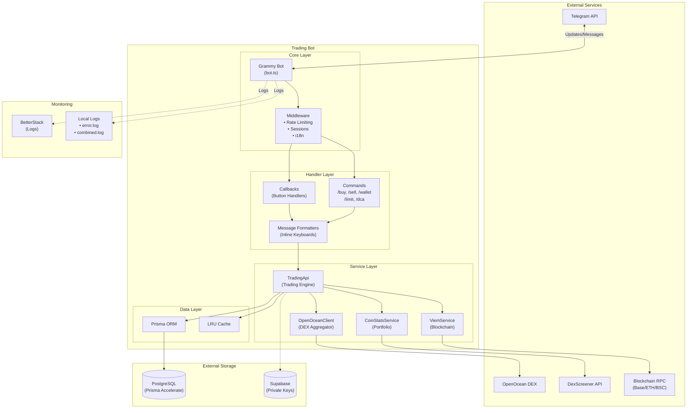
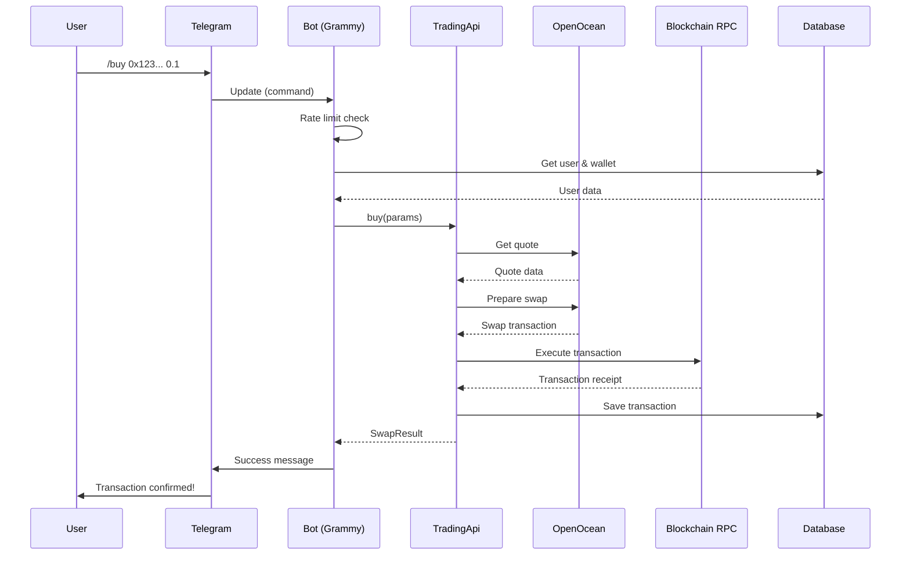
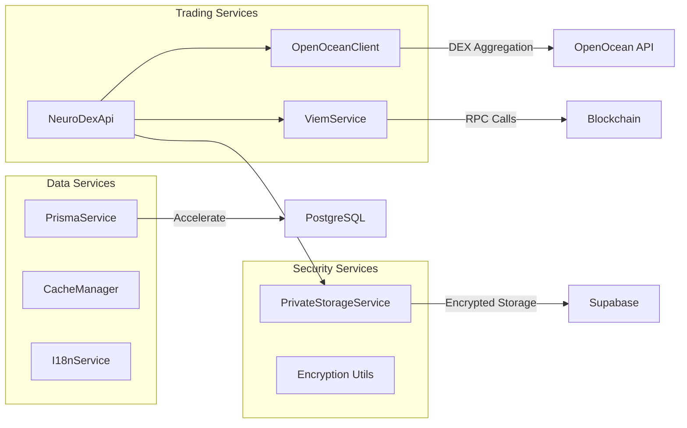

# Development Guide

## Getting Started

### Prerequisites

- Node.js 18+
- pnpm (package manager)
- PostgreSQL database (via Prisma Accelerate)
- Telegram bot token from [@BotFather](https://t.me/BotFather)

### Setup

1. Clone the repository:
```bash
git clone https://github.com/axioma-ai-labs/telegram-trading-bot
cd telegram-trading-bot
```

2. Install dependencies:
```bash
make deps
```

3. Configure environment:
```bash
cp .env.example .env
# Edit .env with your values
```

4. Generate Prisma client:
```bash
pnpm prisma generate --no-engine
```

5. Start development server:
```bash
make dev
```

## Architecture Overview

### System Architecture Diagram



### Data Flow Diagram



### Request Flow (ASCII)

```
Telegram Update
       │
       ▼
┌─────────────────────────────────┐
│      Grammy Bot (bot.ts)        │
│  - Rate limiting middleware     │
│  - Session middleware           │
│  - i18n middleware              │
└───────────────┬─────────────────┘
                │
       ┌────────┴────────┐
       │                 │
       ▼                 ▼
┌─────────────┐   ┌─────────────┐
│  Commands   │   │  Callbacks  │
│ (/buy,/sell)│   │  (buttons)  │
└──────┬──────┘   └──────┬──────┘
       │                 │
       └────────┬────────┘
                │
                ▼
┌─────────────────────────────────┐
│         Message Handlers        │
│ (buyMessages, sellMessages)     │
└───────────────┬─────────────────┘
                │
                ▼
┌─────────────────────────────────┐
│           Services              │
│  - TradingApi (trading)         │
│  - ViemService (blockchain)     │
│  - PrismaService (database)     │
│  - PrivateStorage (keys)        │
└─────────────────────────────────┘
```

### Service Dependencies



### Layer Responsibilities

| Layer | Directory | Responsibility |
|-------|-----------|----------------|
| Commands | `bot/commands/` | Handle slash commands, validate user, route to messages |
| Callbacks | `bot/callbacks/` | Handle button interactions, execute operations |
| Messages | `bot/messages/` | Format messages, create inline keyboards |
| Services | `services/` | Business logic, external API calls, database ops |
| Types | `types/` | TypeScript interfaces and type definitions |
| Utils | `utils/` | Helper functions (encryption, validation, formatting) |

### Session State Management

The bot uses Grammy sessions to maintain user state:

```typescript
interface SessionData {
  startTime: number;
  lastInteractionTime: number;
  currentOperation: OperationState | null;
  currentMessage: MessageContext | null;
}

interface OperationState {
  type: 'buy' | 'sell' | 'dca' | 'limit' | 'withdraw' | 'pk_verification';
  // Operation-specific data
}
```

## Adding New Features

### Adding a New Command

1. Create command handler in `src/bot/commands/`:

```typescript
// src/bot/commands/myCommand.ts
import { MyContext } from '@/types/telegram';

export const myCommand = async (ctx: MyContext): Promise<void> => {
  // Validate user
  const user = await validateUser(ctx);
  if (!user) return;

  // Send response
  await ctx.reply(ctx.t('my-command-response'));
};
```

2. Register in `src/bot.ts`:

```typescript
bot.command('mycommand', myCommand);
```

3. Add i18n keys to `locales/en.ftl`:

```text
my-command-response = Your command response here
```

### Adding a New Callback

1. Create callback handler in `src/bot/callbacks/`:

```typescript
// src/bot/callbacks/myCallback.ts
export const myCallback = async (ctx: MyContext): Promise<void> => {
  await ctx.answerCallbackQuery();
  // Handle callback logic
};
```

2. Register in `src/bot.ts`:

```typescript
bot.callbackQuery('my_callback', myCallback);
```

### Adding a New Service

Follow existing patterns in `src/services/`:

```typescript
// src/services/engine/myService.ts
export class MyService {
  private static instance: MyService;

  public static getInstance(): MyService {
    if (!MyService.instance) {
      MyService.instance = new MyService();
    }
    return MyService.instance;
  }

  public async doSomething(): Promise<Result> {
    // Implementation
  }
}
```

## Code Style

### Formatting

```bash
make format    # Run Prettier
make lint      # Check ESLint rules
make lint-fix  # Auto-fix ESLint issues
```

### Conventions

- Use `async/await` for all asynchronous operations
- Add explicit return types to functions
- Use TypeScript strict mode features
- Follow existing naming conventions:
  - Files: `camelCase.ts`
  - Classes: `PascalCase`
  - Functions/variables: `camelCase`
  - Constants: `UPPER_SNAKE_CASE`

### Imports

Imports are sorted automatically by Prettier:

```typescript
// External packages first
import { Bot } from 'grammy';

// Then internal imports with @/ alias
import { config } from '@/config/config';
import { MyService } from '@/services/myService';

// Then relative imports
import { helper } from './helper';
```

## Building and Running

### Development

```bash
make dev  # Hot reload with ts-node-dev
```

### Production

```bash
make build     # Compile TypeScript
pnpm run start # Run compiled code
```

### Docker

```bash
docker build -t telegram-trading-bot .
docker-compose up -d
```

## Debugging

### Logging

Use the Winston logger:

```typescript
import { logger } from '@/config/logger';

logger.info('Operation completed', { userId, txHash });
logger.error('Operation failed', { error: err.message });
```

Logs are sent to BetterStack in production.

### Common Issues

| Issue | Solution |
|-------|----------|
| Prisma client not found | Run `pnpm prisma generate --no-engine` |
| RPC connection failed | Check RPC URLs in `.env` |
| Bot not responding | Verify `TELEGRAM_BOT_TOKEN` is correct |
| Transaction failed | Check wallet balance and gas settings |

## Database Operations

### Migrations

```bash
make migrate                    # Create and apply migrations
pnpm prisma migrate deploy      # Apply pending migrations (production)
pnpm prisma studio              # Open Prisma Studio GUI
```

### Schema Changes

1. Edit `prisma/schema.prisma`
2. Run `make migrate`
3. Update affected services in `src/services/prisma/`

## Testing

```bash
make test          # Run all tests
pnpm test:load     # Load testing with K6
```

See [testing.md](./testing.md) for detailed testing guide.
